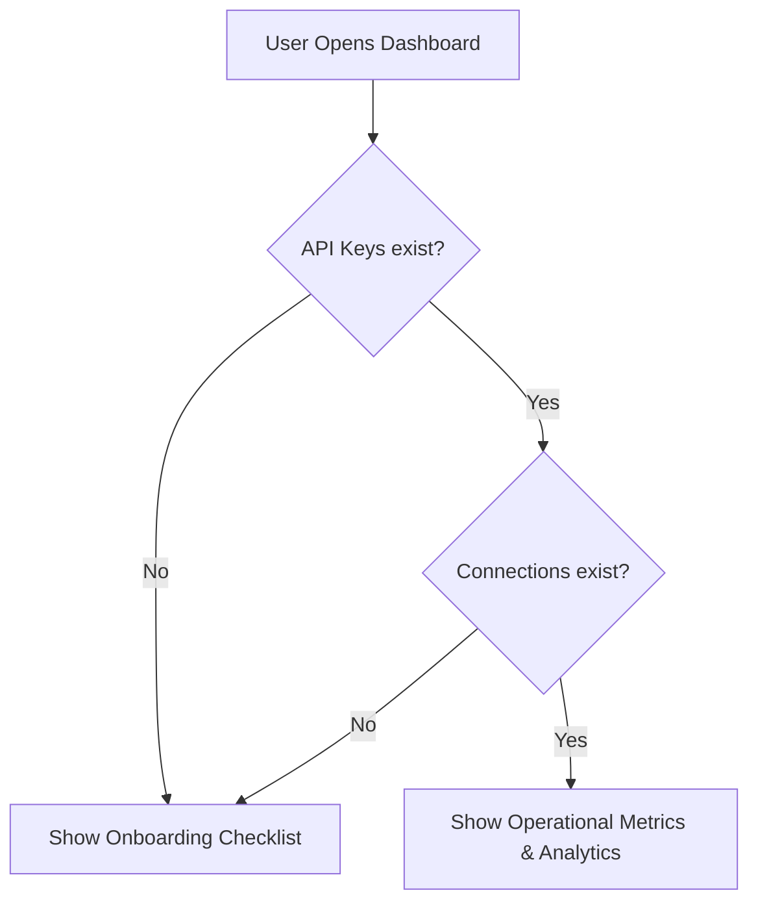

# CPaaS Dashboard UX Architecture & Layout

## Design System & Theme

1. **Aesthetics (Notion/MessageBird style):**
   - **Vibe:** Minimalist, clean, neutral light-mode.
   - **Sidebar:** Soft gray background (`#F9F9FB` or daisyUI `bg-base-200`) with small, clean monochrome icons.
   - **Main Area:** Spacious white background (`#FFFFFF`) with sharp, modern typography (Inter or Roboto font from Google Fonts).
   - **Styling framework:** Tailwind CSS with daisyUI component classes (via CDN for templates, or compiled in build).

2. **Sidebar Hub Navigation:**
   - **Overview:** General workspace throughput metrics and connection status counts.
   - **Connections:** Channels list (WhatsApp Web, WABA, Telegram) with status colors (green = connected, gray = offline, red = terminal/action required).
   - **Developer Sandbox (Playground):** Interactive test panel to send messages and view live webhook responses.
   - **Logs:** Outbound and inbound message audit logs searchable by JID/phone/trace ID.
   - **Workspace Settings:** API keys, webhook URLs, and workspace settings.

## Dynamic Onboarding Checklist (Day 1 UX)

To avoid showing empty graphs to new users, the main overview page dynamically shifts layouts:

### Dynamic Rules
- If `Count(APIKeys) == 0` OR `Count(Connections) == 0` for the current workspace:
  - Render the **Interactive Quick-Start Checklist** with steps:
    1. **Create an API Key** (Redirects to Settings/API Keys modal).
    2. **Connect a Channel** (Link Telegram/WABA or scan WhatsApp Web QR).
    3. **Send a Test Message** (Redirects to Developer Playground).
    4. **Register a Webhook** (Redirects to Webhook Settings).
- Else:
  - Render the **Operational Developer Dashboard** (charts of throughput, latency, queue depths, error rates).
